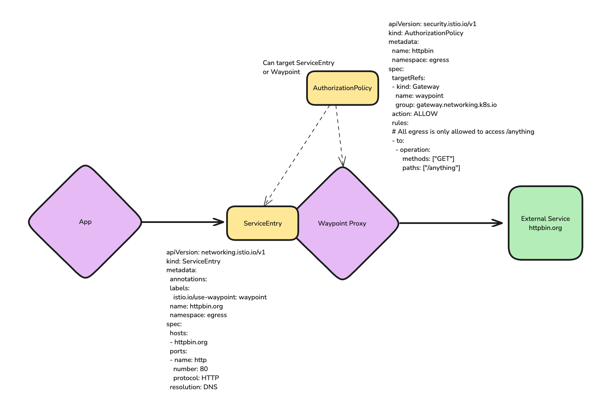

# <center>Upstream Istio Ambient Egress Setup (1.23.2)</center>

## Table of Contents
* [Step 1 - Install Istio Ambient](#step-1---install-istio-ambient-)
* [Step 2 - Configure App and validate mTLS](#step-2---configure-app-and-validate-mtls-)
* [Step 3 - Ambient Egress Traffic with Waypoint](#step-3---ambient-egress-traffic-with-waypoint-)



## Step 1 - Install Istio Ambient <a name="step-1---install-istio-ambient-"></a>

Add ambient helm repo
```bash
helm repo add istio https://istio-release.storage.googleapis.com/charts
helm repo update
```

Install istio-base
```bash
helm upgrade --install istio-base istio/base -n istio-system --version 1.23.2 --create-namespace
```

Install Kubernetes Gateway CRDs
```bash
echo "installing Kubernetes Gateway CRDs"
kubectl get crd gateways.gateway.networking.k8s.io &> /dev/null || \
  { kubectl apply -f https://github.com/kubernetes-sigs/gateway-api/releases/download/v1.1.0/standard-install.yaml; }
```

Install istio-cni
```bash
helm upgrade --install istio-cni istio/cni \
-n istio-system \
--version=1.23.2 \
-f -<<EOF
profile: ambient
ambient:
  dnsCapture: true
# this is going away in 1.24.x
cni:
  ambient:
    dnsCapture: true
EOF
```

Wait for rollout to complete
```bash
kubectl rollout status ds/istio-cni-node -n istio-system
```

Install istiod
```bash
helm upgrade --install istiod istio/istiod \
-n istio-system \
--version=1.23.2 \
-f -<<EOF
profile: ambient
meshConfig:
  accessLogFile: /dev/stdout
  defaultConfig:
    proxyMetadata:
      ISTIO_META_DNS_CAPTURE: "true"
      ISTIO_META_DNS_AUTO_ALLOCATE: "true"
  outboundTrafficPolicy:
    mode: REGISTRY_ONLY
pilot:
  env:
    PILOT_ENABLE_K8S_SELECT_WORKLOAD_ENTRIES: "false"
    PILOT_SKIP_VALIDATE_TRUST_DOMAIN: "true"
    PILOT_ENABLE_IP_AUTOALLOCATE: "true"
EOF
```

Wait for rollout to complete
```bash
kubectl rollout status deploy/istiod -n istio-system
```

Install ztunnel

```bash
helm upgrade --install ztunnel istio/ztunnel \
-n istio-system \
--version=1.23.2 \
-f -<<EOF
hub: docker.io/istio
tag: 1.23.2
resources:
  requests:
      cpu: 500m
      memory: 2048Mi
logLevel: info
EOF
```

Wait for rollout to complete
```bash
kubectl rollout status ds/ztunnel -n istio-system
```

## Step 2 - Configure App and validate mTLS <a name="step-2---configure-app-and-validate-mtls-"></a>

Deploy client into ambient mesh
```bash
kubectl apply -k client/ambient
```

Deploy httpbin into ambient mesh
```bash
kubectl apply -k httpbin/ambient
```

Wait for rollout to complete
```bash
kubectl rollout status deploy/sleep -n client
kubectl rollout status deploy/httpbin -n httpbin
```

Exec into sleep client and curl httpbin
```bash
kubectl exec -it deploy/sleep -n client -c sleep -- curl http://httpbin.httpbin.svc.cluster.local:8000/get
```

Watch logs of ztunnel for traffic interception

```bash
kubectl logs -n istio-system ds/ztunnel -f
```

You should see traffic and mTLS identities in the logs of ztunnel


## Step 3 - Ambient Egress Traffic with Waypoint <a name="step-3---ambient-egress-traffic-with-waypoint-"></a>

Next, we'll create a dedicated `egress` namespace and deploy a shared Waypoint. This Waypoint will serve as a centralized control point for outbound traffic from various namespaces.

```bash
kubectl apply -f - <<EOF
apiVersion: v1
kind: Namespace
metadata:
  labels:
    istio.io/dataplane-mode: ambient
    istio.io/use-waypoint: waypoint
  name: egress
---
apiVersion: gateway.networking.k8s.io/v1
kind: Gateway
metadata:
  name: waypoint
  namespace: egress
spec:
  gatewayClassName: istio-waypoint
  listeners:
  - name: mesh
    port: 15008
    protocol: HBONE
    allowedRoutes:
      namespaces:
        from: All
EOF
```

Wait for the Waypoint deployment to be fully operational before proceeding.

```bash
kubectl -n egress rollout status deployment/waypoint
```

Next, create a Service Entry to represent the external service 'httpbin.org' and by setting the labels `istio.io/use-waypoint` and `istio.io/use-waypoint-namespace` we configure traffic targeted at this service entry to be routed through the shared egress waypoint.

```bash
kubectl apply -f - <<EOF
apiVersion: networking.istio.io/v1
kind: ServiceEntry
metadata:
  annotations:
  labels:
    istio.io/use-waypoint: waypoint
  name: httpbin.org
  namespace: egress
spec:
  hosts:
  - httpbin.org
  ports:
  - name: http
    number: 80
    protocol: HTTP
  resolution: DNS
EOF
```

To confirm that traffic is correctly flowing through the Waypoint, send a request to the external service and look for Envoy-specific headers in the response. These headers indicate that the traffic has been processed by the Waypoint.

Exec into sleep client and curl httpbin
```shell
kubectl exec -it deploy/sleep -n client -c sleep -- curl -sI httpbin.org/get | grep envoy
```

```http,nocopy
server: istio-envoy
x-envoy-upstream-service-time: 255
x-envoy-decorator-operation: :80/*
```

The presence of Envoy headers in the response confirms that our traffic is being routed through the Waypoint as intended.

We can confirm that traffic intended for httpbin.org is intercepted by our egress waypoint by looking at the logs
```bash
kubectl logs -n egress deploy/waypoint -f
```

We should see access logs that our traffic is being routed through our waypoint on each request
```
[2024-10-24T15:36:26.008Z] "HEAD /get HTTP/1.1" 200 - via_upstream - "-" 0 0 160 160 "-" "curl/8.10.1" "5257e961-a040-4d33-9ff8-844ea8a08553" "httpbin.org" "44.196.139.143:80" inbound-vip|80|http|httpbin.org 10.42.0.16:40144 240.240.0.4:80 10.42.0.13:42172 - default
[2024-10-24T15:38:40.182Z] "HEAD /get HTTP/1.1" 200 - via_upstream - "-" 0 0 573 573 "-" "curl/8.10.1" "f8aeb684-df0a-46ac-9f04-c2e6b54c2f56" "httpbin.org" "34.228.248.173:80" inbound-vip|80|http|httpbin.org 10.42.0.16:33126 240.240.0.4:80 10.42.0.13:42172 - default
```

### Transforming Traffic in Egress Waypoint

To demonstrate the traffic management capabilities of our Waypoint, we'll apply a VirtualService that adds a custom header to outbound requests. This illustrates how you can modify and control egress traffic at the Waypoint level.

```bash
kubectl apply -f - <<EOF
apiVersion: networking.istio.io/v1
kind: VirtualService
metadata:
  name: httpbin
  namespace: egress
spec:
  hosts:
  - httpbin.org
  http:
  - route:
    - destination:
        host: httpbin.org
    headers:
      request:
        add:
          my-added-header: added-value
EOF
```

Verify that the new header is present in your requests to the external service.

```shell
kubectl exec -it deploy/sleep -n client -c sleep -- curl -s httpbin.org/get | grep -i my-added-header
```

Expected output:

```http,nocopy
    "My-Added-Header": "added-value",
```

### Securing Egress Traffic with Encryption

To enhance security, we'll now configure TLS encryption for our egress traffic. This involves updating the ServiceEntry to redirect traffic to a secure port and creating a DestinationRule to enable TLS.

```bash
kubectl apply -f - <<EOF
apiVersion: networking.istio.io/v1
kind: ServiceEntry
metadata:
  annotations:
  labels:
    istio.io/use-waypoint: waypoint
  name: httpbin.org
  namespace: egress
spec:
  hosts:
  - httpbin.org
  ports:
  - number: 80
    name: http
    protocol: HTTP
    targetPort: 443 # New: send traffic originally for port 80 to port 443
  resolution: DNS
---
apiVersion: networking.istio.io/v1
kind: DestinationRule
metadata:
  name: httpbin.org-tls
  namespace: egress
spec:
  host: httpbin.org
  trafficPolicy:
    tls:
      mode: SIMPLE
EOF
```

Confirm that your traffic is now encrypted by checking the URL scheme in the response.

```shell
kubectl exec -it deploy/sleep -n client -c sleep -- curl -s httpbin.org/get | jq .url
```

Expected output:

```,nocopy
"https://httpbin.org/get"
```

### Implementing Egress Authorization Policies

Finally, we'll apply an authorization policy to our Waypoint. This policy will allow only specific types of requests (in this case, GET requests to a particular path) and block all others, providing fine-grained control over outbound traffic.

```bash
kubectl apply -f - <<EOF
apiVersion: security.istio.io/v1
kind: AuthorizationPolicy
metadata:
  name: httpbin
  namespace: egress
spec:
  targetRefs:
  - kind: Gateway
    name: waypoint
    group: gateway.networking.k8s.io
  action: ALLOW
  rules:
  # All egress is only allowed to access /anything
  - to:
    - operation:
        methods: ["GET"]
        paths: ["/anything"]
EOF
```

> Note: [PR #3271](https://github.com/istio/api/pull/3271) when released (potentially 1.23.3) enables us to use the ServiceEntry as the target reference in the `AuthorizationPolicy`. Thus the policy applies only to the ServiceEntry and not the entire `Gateway`.

Confirm that the authorization policy is correctly enforced by attempting to access a different path on the external service. You should observe that the request is blocked.

```shell
kubectl exec -it deploy/sleep -n client -c sleep -- curl httpbin.org/get
```

Expected output:
```http,nocopy
% kubectl exec -it deploy/sleep -n client -c sleep -- curl httpbin.org/get
RBAC: access denied
```

Now try again with /anything

```shell
kubectl exec -it deploy/sleep -n client -c sleep -- curl httpbin.org/anything
```

Expected output:
```http,nocopy
% kubectl exec -it deploy/sleep -n client -c sleep -- curl httpbin.org/anything
{
  "args": {}, 
  "data": "", 
  "files": {}, 
  "form": {}, 
  "headers": {
    "Accept": "*/*", 
    "Host": "httpbin.org", 
    "My-Added-Header": "added-value", 
    "User-Agent": "curl/8.10.1", 
    "X-Amzn-Trace-Id": "Root=1-671a91a7-5c3d873715f37aee64a10101"
  }, 
  "json": null, 
  "method": "GET", 
  "origin": "71.202.124.203", 
  "url": "https://httpbin.org/anything"
}
```

By setting up a Waypoint in the egress namespace and restricting direct outbound traffic, we've created a centralized point of control for all egress traffic. This setup allows for consistent policy enforcement, traffic management, and security measures across your entire mesh. Such an approach is crucial for maintaining compliance and security in enterprise environments.